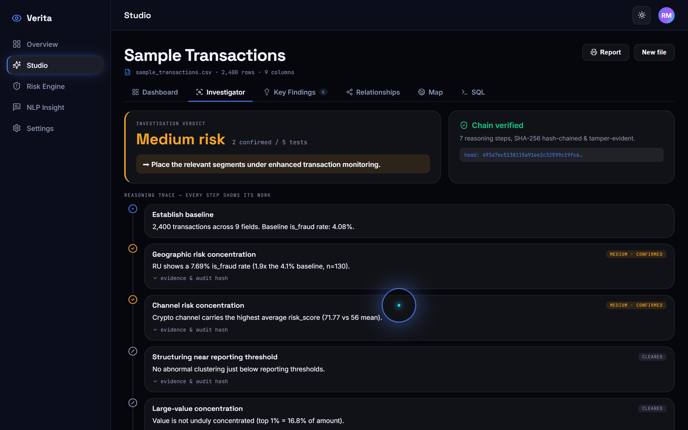

<div align="center">

# Verita

### Financial Crime & Compliance Intelligence

**Upload any financial dataset → an instant, editable, BI-grade dashboard.
Score transactions for fraud with real machine learning. Ask your data in plain English.
No BI tool to learn, no black boxes.**

`Python · FastAPI · Pandas · scikit-learn · DuckDB` · `React · TypeScript · ECharts · Three.js`

[](https://github.com/rajmodi262/verita/actions/workflows/ci.yml)     

<br/>


</div>

---

## ⭐ The flagship: Auditable Compliance Investigator

The novelty isn't a new algorithm — it's a **design thesis**. Agentic AI is unusable in finance if
it's a black box: a regulator must be able to *reproduce and audit* every decision. Verita's
Investigator is an **autonomous agent that shows its work**. Click *Run* and it:

1. plans AML/fraud hypotheses from the data's shape,
2. **tests each one with a real DuckDB query + statistic** (the query is part of the record),
3. ranks confirmed findings and writes a cited compliance memo, and
4. **hash-chains the entire reasoning trace** (each step's SHA-256 folds in the previous step's hash) —
   so the investigation is tamper-evident and reproducible. Doctor any step and the chain breaks.

> *"Most AI analytics tools are black boxes. Verita makes every auto-generated number show its
> formula and every agent decision show its query — then seals the trace in a tamper-evident chain.
> Built for FCC, because that's the one domain where you legally can't act on a number you can't
> defend to a regulator."*



---

## Screenshots

| Auto-Dashboard Studio | Key Findings (with evidence) |
|---|---|
|  |  |
| **Relationship map (Pearson + η²)** | **Auto geo-map** |
|  |  |
| **SQL playground (DuckDB)** | **FCC Risk & Anomaly Engine** |
|  |  |
| **NLP compliance analyzer** | **Animated landing** |
|  |  |

---

## Why Verita exists

Power BI's real cost isn't the charts — it's the *first hour* of setup before you see one. Verita
collapses that hour to a single file drop: it profiles your data, finds what matters, and builds the
dashboard an analyst would have built — then lets you rearrange it, query it in SQL, and forecast it.

Built to map 1:1 against the **Wolters Kluwer FSS/FCC Data Science** role. The full traceability
matrix (every JD keyword → the feature that satisfies it) lives in
**[`JD_FEATURE_MAP.md`](JD_FEATURE_MAP.md)**.

## The honesty policy (the project's spine)

Every number Verita shows is computed from your data at request time. There are **no hardcoded
metrics, no `random()` charts, no fabricated explanations.** Concretely:

- Every auto-insight carries its exact `pandas`/`scipy` formula — click **"how was this computed?"**
- Forecasts ship their **backtest MAPE** on held-out periods, and the model is chosen by a tournament.
- The relationship map **refuses to draw** relationships that aren't statistically there.
- The risk model reports **held-out** ROC-AUC / precision-recall — never training-set scores.
- GenAI is a real, optional enhancement (Gemini); without a key the deterministic engines run, and
  the active mode is reported honestly at `/api/health`.

---

## Three pillars

### 1 · Auto-Dashboard Studio
Drop a CSV/Excel → an **X-ray scan** profiles every column (semantic type, distribution, missingness,
quality score) → a recommendation engine builds the best charts → an **editable Power-BI-style canvas**
(drag, resize, remove — your layout persists). Plus: auto **executive summary**, **Key Findings** with
significance tests, a **relationship map** (Pearson + η²), a real **DuckDB SQL console** with NL→SQL,
a **world geo-map**, a **forecast overlay**, a **Time Machine** scrubber, **"what changed?"** period
diffs, **pin-SQL-to-dashboard**, and a one-click **PDF report**.

### 2 · FCC Risk & Anomaly Engine
A real ML pipeline (**XGBoost** classifier + IsolationForest) trained on the **real ULB
credit-card fraud dataset** (284k transactions, 0.17% fraud) → held-out **ROC-AUC ≈ 0.99, PR-AUC
≈ 0.88** on the default 150k-row seeded sample (set `VERITA_ULB_SAMPLE` higher to train on more).
XGBoost uses `scale_pos_weight` to handle the 0.17% imbalance directly in the loss.
Honest metrics throughout, a live **decision-threshold slider** (watch precision/recall trade off),
plus a **cost-optimal threshold** that minimises expected dollar loss (`/api/risk/optimal-threshold`),
**per-case SHAP reason codes** (`/api/risk/explain/{idx}` → `model_explainer.py`), a **PSI drift
monitor**, ROC & precision-recall curves, confusion matrix, **permutation** feature importance, and
a ranked **AML alert queue**. Drop `creditcard.csv` (or the Kaggle 5M-row
`financial_fraud_detection_dataset.csv`) into `data/`, or set `VERITA_FRAUD_DATA` — otherwise it
falls back to a clearly-labeled synthetic set. The fitted model is cached to `joblib` (trains once
~2min, loads in ~2s after).

### 3 · NLP Insight
Paste a transaction narrative or alert → entity extraction + **BSA / AML / OFAC / FinCEN** matching +
a transparent risk score with the exact signals that drove it + a recommended action
(File SAR / Investigate / Monitor).

---

## Quickstart

### Windows — one click
Double-click **[`start.bat`](start.bat)**. On first run it creates a Python virtual environment,
installs all backend + frontend dependencies, launches both servers, and opens the app in your
browser. Subsequent runs skip the install and start in seconds. (Zero config — the audit trail uses
a local SQLite file; no Docker needed.)

### Manual (any OS)

```bash
# 1) Backend  (Python 3.10+)
cd backend
pip install -r requirements.txt
uvicorn app.main:app --reload          # → http://localhost:8000  (docs at /docs)

# 2) Frontend (Node 18+)
cd frontend
npm install
npm run dev -- --port 5173             # → http://localhost:5173
```

### With PostgreSQL + monitoring
```bash
docker compose up          # Postgres, backend, frontend, Prometheus, Grafana
```

Then open the app, click **Studio**, and drop
[`data/sample_transactions.csv`](data/sample_transactions.csv) — or hit **Investigator** and let
the agent screen it.

**Or the whole stack in containers** (backend + frontend + Prometheus + Grafana):

```bash
docker compose up --build
```

### Tests

```bash
cd backend  && python -m pytest -q     # 62 tests
cd frontend && npm run test            # 10 tests
```

---

## Architecture

```
            React + TS + ECharts + Three.js (Vite)
                          │  REST
                          ▼
   FastAPI  ──  middleware: API-key auth · rate limit · global error handler
     │
     ├─ profiling/   semantic typing · quality score · insights (scipy) · relationships · forecast tournament
     ├─ ml/          XGBoost + IsolationForest (held-out metrics, joblib-persisted)
     │               + model_explainer: SHAP reason codes · cost-optimal threshold · PSI drift
     ├─ nlp/         BSA/AML/OFAC/FinCEN matcher · entity extraction · risk scoring
     ├─ genai/       optional Gemini (summary + NL→SQL) with rule-based fallback
     └─ store        disk-backed dataset cache (survives restart) + DuckDB SQL engine
```

**Engineering posture:** the dataset store is disk-backed (uploads survive a restart), the risk model
is persisted (0.36 s boot vs 21 s retrain), profiles are computed once and cached, and the SQL console
runs DuckDB with `enable_external_access=False` behind a SELECT-only, comment-blocking, catalog-denying
guard (covered by an adversarial injection test corpus).

## Tech stack

| Layer | Tech |
|---|---|
| Backend | FastAPI · Pandas · NumPy · scikit-learn · XGBoost · SHAP · SciPy · DuckDB · joblib |
| Frontend | React 18 · TypeScript · Vite · ECharts · Three.js · framer-motion · react-grid-layout · zustand |
| GenAI | Google Gemini (optional) with deterministic fallback |
| Infra | Docker · docker-compose · GitHub Actions · Prometheus · Grafana |
| Tests | pytest (62) · Vitest + Testing Library (10) |

## Configuration

All optional — Verita runs zero-config. See [`backend/.env.example`](backend/.env.example).
Notably: `VERITA_API_KEY` (turns on `X-API-Key` auth), `VERITA_RATE_LIMIT`, and `GEMINI_API_KEY`
(turns on LLM-enhanced summary + NL→SQL).

## Project layout

```
verita/
├── backend/        FastAPI app, ML, NLP, profiling, tests
├── frontend/       React app, components, tests
├── data/           sample dataset
├── docs/           implementation plan, design system, demo script
├── monitoring/     prometheus + grafana config
├── .github/        CI pipeline
├── JD_FEATURE_MAP.md   ← JD keyword → feature traceability
└── docker-compose.yml
```

See **[`docs/DEMO_SCRIPT.md`](docs/DEMO_SCRIPT.md)** for the 3-minute walkthrough.

### For interviewers / reviewers

- **[`BUSINESS_CASE.md`](BUSINESS_CASE.md)** — why a bank should run this, ROI math, vs rule-based systems.
- **[`INTERVIEW_PREP.md`](INTERVIEW_PREP.md)** — 150 Q&A, each mapped to the exact code that backs it.
- **Report figures:** `cd backend && python scripts/generate_report_figures.py` renders the confusion
  matrix, ROC/PR curves, feature importance, SHAP summary, and the cost-vs-threshold curve to
  `backend/reports/*.png` — all from the trained model, nothing hardcoded.
